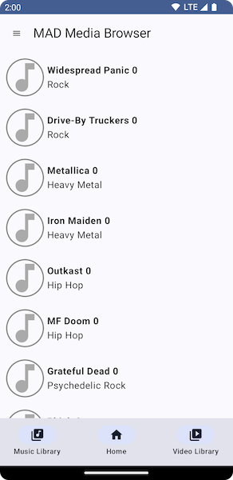

# Modern Android Media Browser
A POC sample app

## Purpose
Showcase competancy in modern Android development best practices, to aid in landing my next job and keeping my head in the game.

## Backstory
I was laid off as part of a 10% staff reduction in March. After a much needed sabbatical, I'm eagerly looking for my next Android adventure.
This project aims to keep me busy and my skills fresh until I land my next job. UI/UX polish is taking a backseat to engineering best practices to 
begin with, but I look forward to improving that as well. It will be a perpetual work in progress.

I welcome any and all feedback. Thanks!

## What's implemented so far
### Features
- Multiple product versions: Free vs Paid
- Custom splash screen with branding message
- Material 3 App Theming
- Material 3 App Scaffolding, with top and bottom bars, plus navigation drawer
- Dark Theme Support, including option to override system setting
- Work in progress (like search results location) survives configuration changes (e.g. layout mode, locale)
- View all 7K+ bands and 250K+ performances uploaded to the [Live Music Archive](https://archive.org/details/etree)

### Tech
- Kotlin, Coroutines and Flows 
- Jetpack Compose
- Jetpack Navigation
- Jetpack Lifecycle Components
- Jetpack ViewModel
- Jetpack Datastore, for local settings prefs storage
- Jetpack Hilt, for Dependency Injection
- Layered Architecture
- MVVM in the UI layer
- Unidirectional Data Flow
- REST API integration with OkHttp, RetroFit, and Moshi
- Behavior testing with JUnit 5
- ViewModel tests
- Domain and Data Layer tests (with OkHttp MockWebserver)

## In flight
### MVP Functionality
- Click from Album to Song List Screen.
- Play songs

## On Deck
- Save favorite artists and/or albums
- UI tests with Espresso
- Optimize layout in landscape mode
- TOML version catalogue for dependencies
- WorkManager (for syncing)
- Offline first
- Play a video
- Ship as app bundle
- cool splash effect
- cool animations
- timber for logging
- Baseline profiles
- Biometric authentication
- Android integration with Instrumentation tests
- App Widget with Glance
- WearOS version
